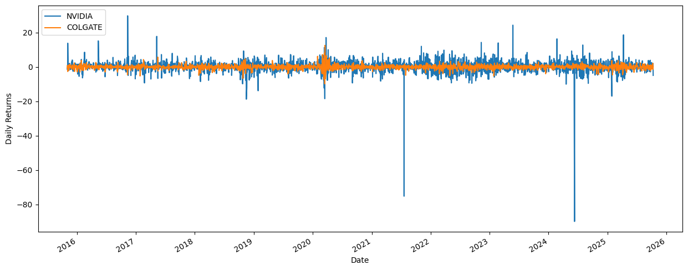

# **Stock Volatility Prediction System**
# Overview
This project presents an end-to-end stock volatility prediction system that integrates data engineering, time-series modeling, and deployment. The model leverages the GARCH (Generalized Autoregressive Conditional Heteroskedasticity) framework to forecast volatility patterns in stock returns. The workflow includes:
- Extracting daily stock data using the AlphaVantage API
- Storing structured data in a SQLite database
- Performing time-series analysis to measure and visualize volatility
- Training and evaluating a GARCH(1,1) model
- Deploying predictions through a FastAPI REST API

This project is organized around the PACE framework (Plan, Analyze, Construct, Execute), to ensure a systematic and reproducible approach.

# Business Understanding
Volatility is a key metric for investors, traders, and financial analysts. It represents the degree of variation in a stock’s returns over time and is directly linked to risk and market sentiment.

**Business Objectives:**
- Quantify volatility trends for individual stocks (e.g., NVIDIA, Colgate, Apple).
- Compare and interpret volatility levels across different companies.
- Build a predictive model that forecasts future volatility for investment decision-making.
- Deploy an accessible API that serves real-time volatility predictions for any stock ticker.

**Real-World Applications:**
- Portfolio risk management
- Option pricing models
- Trading strategy optimization
- Financial forecasting systems

# Data Understanding
Stock data was sourced from the AlphaVantage API. Each record includes the following fields:
- open – Opening price
- high – Highest price of the day
- low – Lowest price of the day
- close – Closing price
- volume – Number of shares traded

**Data Pipeline:**
1. Extraction – Retrieve daily time series data for selected tickers (e.g., NVDA, CL, AAPL).
2. Transformation – Convert JSON responses into pandas DataFrames with proper datetime indexing.
3. Storage – Save structured data in a stocks.sqlite database using SQLAlchemy and pandas.
4. Exploration – Visualize stock price trends, calculate daily returns, and analyze volatility distributions.

**Observations:**
- NVIDIA exhibits high volatility due to its growth and exposure to tech market dynamics.
- Colgate-Palmolive shows lower volatility, typical of stable consumer goods companies.
- Daily returns approximate a normal distribution centered around zero.

From the figure above, the returns for Nvidia have a wider spread. In contrast, the spread for Colgate is narrower, meaning that the price doesn't fluctuate as much. 

# Modeling and Evaluation
The volatility prediction model uses the GARCH(1,1) framework, which captures volatility clustering — the tendency for periods of high volatility to follow one another.

**Modeling Steps**

- Stationarity Check & Preprocessing – Calculate percentage daily returns.
- Train-Test Split – 80% training, 20% testing.
- Model Training – Fit multiple GARCH(p, q) variants and compare based on AIC/BIC.
- Best Model – GARCH(1,1) chosen for best trade-off between complexity and accuracy.
- Validation – Performed using walk-forward validation to simulate real-world forecasting.

**Key Metrics**

| Metric | Description | Result
|:--- | :-------- | :-------- |
| AIC | Akaike Information Criterion | 6074.62 |
| BIC | Bayesian Information Criterion | 6097.02 |
| α | Short-term volatility response | 0.1059 |
| β | Long-term volatility persistence | 0.7988 |

**Model Evaluation**

- The conditional volatility curve tracks observed returns closely.
- Standardized residuals show no autocorrelation, confirming model adequacy.
- Model successfully forecasts short-term volatility (1–10 days ahead).

**Deployment**

The trained model is deployed via FastAPI, enabling real-time prediction through HTTP endpoints.

# Conclusion
This project demonstrates how to design and deploy a complete data science solution — from data ingestion to production-ready API.

**Key Takeaways**
- Volatility modeling with GARCH captures essential financial patterns.
- Data persistence with SQLite supports modularity and reproducibility.
- FastAPI integration makes the model accessible to both humans and systems.

**Next Steps**
- Extend to LSTM or hybrid models for nonlinear volatility behavior.
- Add dashboard visualization using Streamlit or Dash.
- Integrate real-time data streaming for continuous model updates.

----
----
# Tech Stack
| Tools |
|:--- |
| Python (pandas, numpy, matplotlib, arch, statsmodels) |
| Database: SQLite |
| API & Deployment: FastAPI, Uvicorn |
| Version Control: Git & GitHub |

